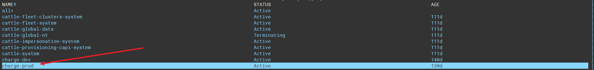
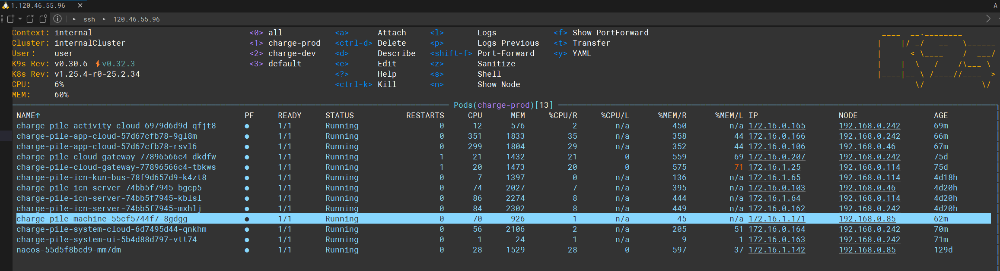

# 充电桩通讯端 [charge-pile-machine-server](charge-pile-machine-server)

## 生产日志查看
ssh 登录中间服务器：120.46.55.96 密钥：kube-prod-key.pem文件，仅仅私人保存请勿泄露！！！  </br>
执行 command:k9s (可自行学习这个工具)  </br>
充电桩命名空间：charge-dev 测试环境  </br>
充电桩命名空间：charge-pord 生产环境  </br>
上下箭头选择命名空间，回车选择进入ns  </br>



键盘s进入容器，日志存放目录格式统一，~/logs/服务名  <br>
当前调试日志每个设备单独存储 格式 pile_桩号.log
服务主日志是 application.log <br>
<hr>


## 客户端测试模块 [charge-pile-client-network]
自己模拟充电桩设备的伪装客户端，无用

## restApi 微服务调用模块 [charge-pile-platform-api](charge-pile-platform-api)
暂时没有使用接口实现

### 重要参数说明
```properties
# 服务端通讯模型 tio or netty
machine.server.net-socket-model=netty

# 指令下发，设备控制接收队列
machine.pile.mq.pile-control-queue=pile.machine.control.queue
# 扇形交换区，设备端消息推送
machine.pile.mq.message-exchange=pile-fanout-exchange
machine.pile.mq.fanout-exchange-queues[0]=pile.app.machine.message.queue
machine.pile.mq.fanout-exchange-queues[1]=pile.system.machine.message.queue
```

### 服务端启动类
MachineNetServer.java netty 实现的服务端启动 <br>
MachineTioServer.java Tio框架实现的服务端启动（升级netty后不再使用！！！） <br>

### 基础包描述
com.huamar.charge.pile.server.protocol (TCP协议包解码相关) <br>
com.huamar.charge.pile.server.handle  (TCP 框架层面的拦截器 ) <br>
com.huamar.charge.pile.server.session  (TCP session 维护相关) <br>

### 核心业务包（com.huamar.charge.pile.server.service）
对照协议模块分包 <br>
[factory]       重要，所有功能的工厂，基本所有功能都是从工厂获取实现 <br>
[answer]        应答回复 <br>
[command]       指令下发  <br>
[common]        通用应答  <br>
[event]         设备事件汇报 <br>
[fault]         设备故障汇报 <br>
[handler]       核心业务处理器，ProtocolCodeEnum.java 根据消息ID 执行对应的实现拦截器 <br>
[machine]       设备信息操作 <br>
[parameter]     参数下发 <br>
[produce]       设备端消息发送，主要与应用层通信<br>
[receiver]      消息处理模块，处理应用发送的信息，主要是设备控制功能<br>
[upload]        设备数据汇报协议<br>

## 充电核心流程
设备连接认证 <br>
设备端推送设备实时状态 <br>
服务端获取设备在线状态 <br>